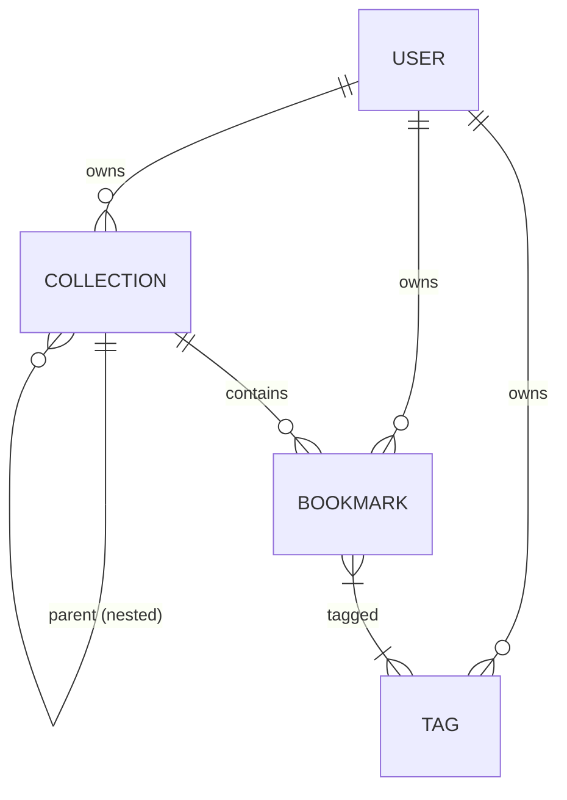

# Database Schema (Supabase PostgreSQL + Prisma)

This document outlines the database schema for the IT Bookmark platform.

## Overview
The schema is designed using Prisma and targets a normalized PostgreSQL database. It supports core bookmark management features including nested collections and many-to-many tag relationships.

## Entity Relationship Diagram (ERD)

## Tables

### 1. `User`
Stores authentication and profile data.
- `id` (UUID, Primary Key)
- `email` (String, Unique)
- `password` (String) - Hashed with bcrypt
- `name` (String, Nullable)
- `createdAt` (DateTime)
- `updatedAt` (DateTime)

### 2. `Collection`
Represents a folder or category. Supports nesting via self-referencing `parentId`.
- `id` (UUID, Primary Key)
- `name` (String)
- `description` (String, Nullable)
- `color` (String, Default: `#3b82f6`)
- `userId` (UUID, Foreign Key -> User)
- `parentId` (UUID, Nullable, Foreign Key -> Collection)
- `createdAt` (DateTime)
- `updatedAt` (DateTime)

### 3. `Tag`
Used to categorize bookmarks orthogonally to Collections.
- `id` (UUID, Primary Key)
- `name` (String)
- `color` (String, Nullable)
- `userId` (UUID, Foreign Key -> User)
- `createdAt` (DateTime)
- **Constraints**: `[name, userId]` must be unique.

### 4. `Bookmark`
The core entity storing links and extracted metadata.
- `id` (UUID, Primary Key)
- `title` (String)
- `url` (String)
- `description` (String, Nullable)
- `favicon` (String, Nullable)
- `image` (String, Nullable)
- `notes` (Text, Nullable)
- `isArchived` (Boolean, Default: false)
- `isFavorite` (Boolean, Default: false)
- `readLater` (Boolean, Default: false)
- `userId` (UUID, Foreign Key -> User)
- `collectionId` (UUID, Nullable, Foreign Key -> Collection)
- `createdAt` (DateTime)
- `updatedAt` (DateTime)

### 5. `_BookmarkTags` (Implicit Join Table)
Created automatically by Prisma to resolve the many-to-many relationship between `Bookmark` and `Tag`.
- `A` (Foreign Key -> Bookmark)
- `B` (Foreign Key -> Tag)

## Indexing Strategy
- **Foreign Keys**: Indexes are placed on `userId` and `collectionId` fields across all tables to optimize read operations (e.g., fetching a user's dashboard).
- **Unique Constraints**: Used for `User.email` and `[Tag.name, Tag.userId]` to prevent duplicate tags for the same user.
- **Cascading Deletes**: 
  - Deleting a `User` will cascade and delete their collections, tags, and bookmarks.
  - Deleting a `Collection` does NOT cascade delete bookmarks; it sets `collectionId` to NULL (preventing accidental data loss of the bookmarks themselves).
